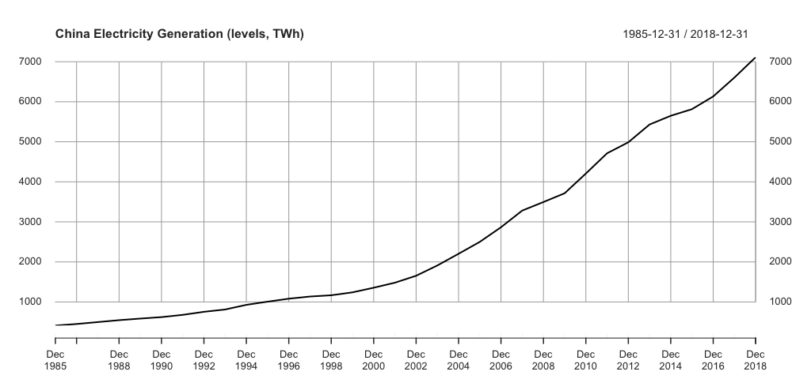
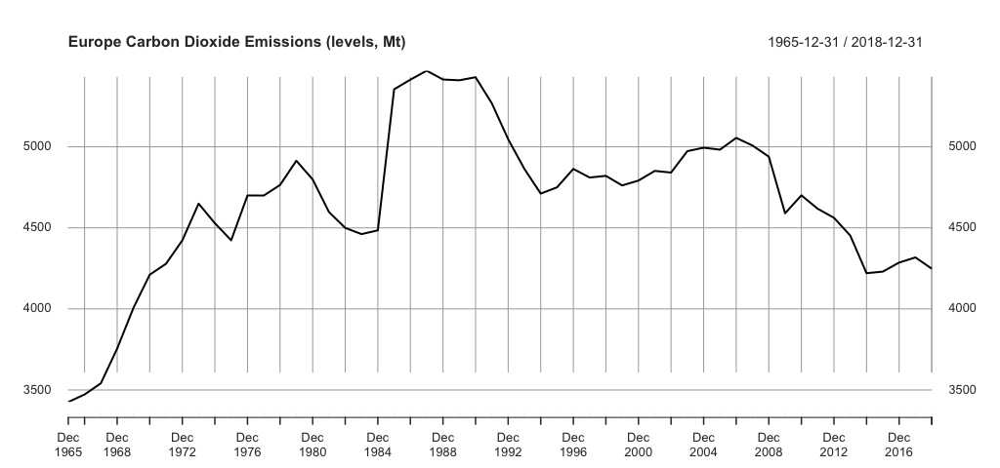
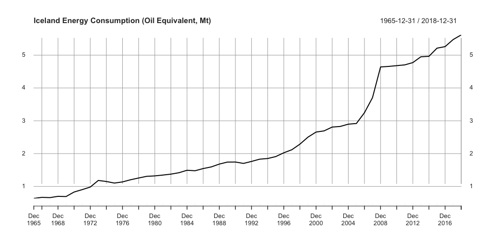
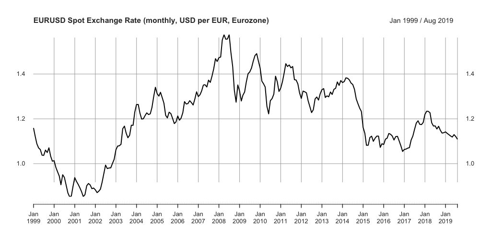
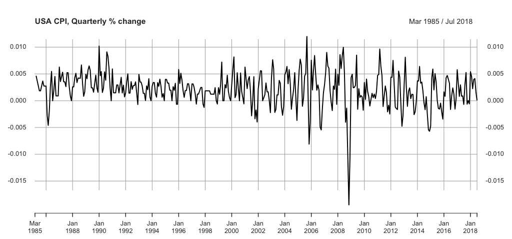
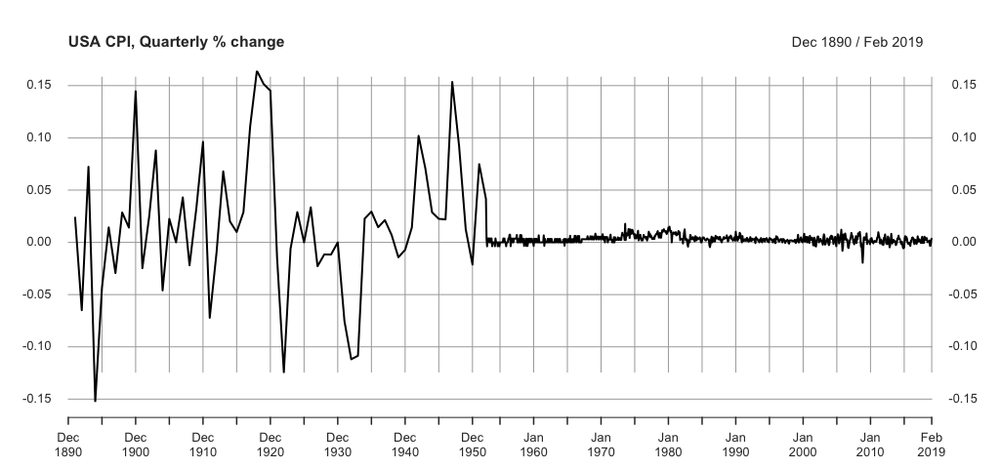
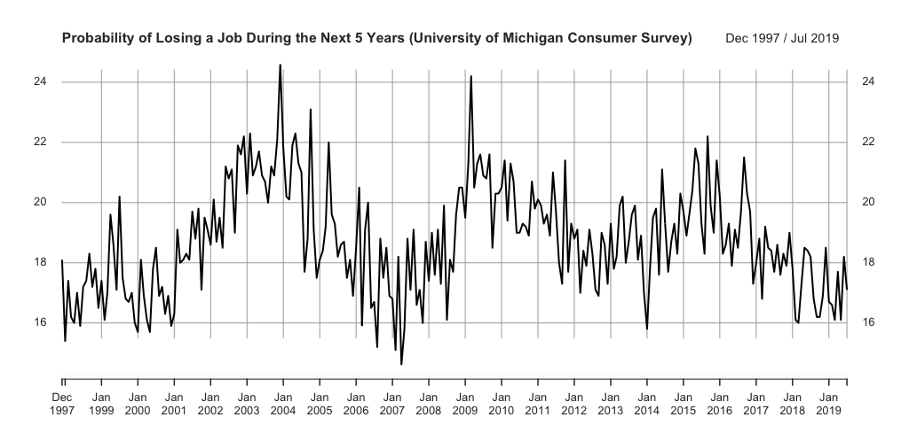
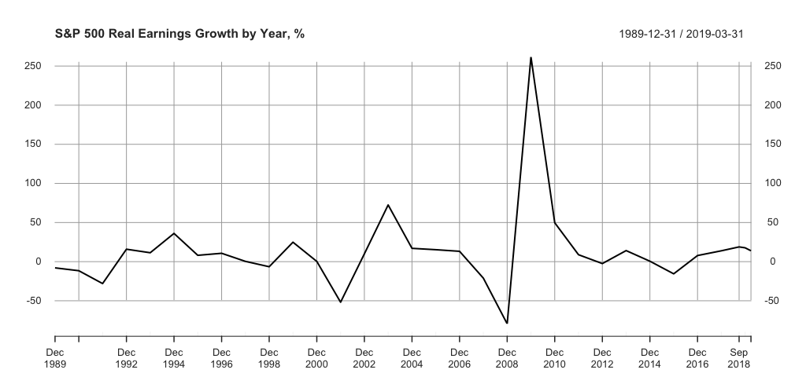

class: section, animated, flipInY

##Quiz 1

#Intro to the course & Stationarity

### it is not graded yet, but take it seriously

---
class: animated, fadeIn

#Quick recall

- each practice session **starts with a quiz**

--

- **the quizzes are graded**</br>.rmk[apart from today's one]

--

- they are **strictly in-class, individual & closed-book**

--

- you'll need a personal device connected to the internet</br></br>

--

#A very important change

.RUred[from now on, the quizzes are taken in **Wooclap** system]

---
class: center, animated, fadeIn

# Getting ready for the first quizz</br></br>
--

##1. Use your device, check the internet connection

.rb[!] In the future, please make sure to **do that in advance**</br></br>

--

##2. Go to **wooclap.com/TSQ**

.rb[!] In the future, keep an eye on the link - **it's gonna change**

---
class: center, animated, fadeIn

# Getting ready for the first quizz

##3. At **wooclap.com/TSQ** you're gonna find


now and always, use your **real name** in the format</br>**17x Name Surname**

---
class: center, animated, fadeIn

# Getting ready for the first quizz

##4. Once entred your name, **you're in!**


**.RUred[Get ready! We're about to start!]**

---
class: center, animated, bounceIn

</br></br>

#Quiz 1

###time remaining

```{r echo=FALSE}
countdown::countdown(minutes = 11, seconds = 00,
                     left=0, right=0, padding='20px', margin='10%', font_size = '5em')
```

---
class: section, animated, fadeIn

#Stationarity

### several questions

---
class: center, animated, fadeIn

#Questions from the lecture</br></br>

.bb[?] Does weak stationarity imply strict stationarity?</br></br>*Construct a counterexample.*</br></br></br>

--

.bb[?] What are some common types of non-stationarity</br>in economic data?</br></br>*Provide real-life examples of each.*

---
class: animated, fadeIn

#Problem 1

### For each of the following examples give and explain answers to the following</br></br>

.bb[?] Is it likely that the TS is stationary or not?</br></br>

.bb[?] If not, what types of non-stationarity are present?</br></br>

.bb[?] What kinds of testing do we need to conclude that?</br></br>

.bb[?] Is it likely that the propoerty persists if we consider another source of data or time period?

---
class: center, animated, fadeIn

###.gb[Example 1]



---
class: center, animated, fadeIn

###.gb[Example 2]



---
class: center, animated, fadeIn

###.gb[Example 3]



---
class: center, animated, fadeIn

###.gb[Example 4]


---
class: center, animated, fadeIn

###.gb[Example 5]



---
class: center, animated, fadeIn

###.gb[Example 6]



---
class: center, animated, fadeIn

###.gb[Example 7]



---
class: center, animated, fadeIn

###.gb[Example 8]



---
class: ticket

### Pick a piece of paper (A5 or A6) & sign your name on it

#Write a question or a short comment</br>on today's class

###Hand it over on your way out


---
class: center, middle, animated, zoomIn

#Thank you!

### See you next time.
